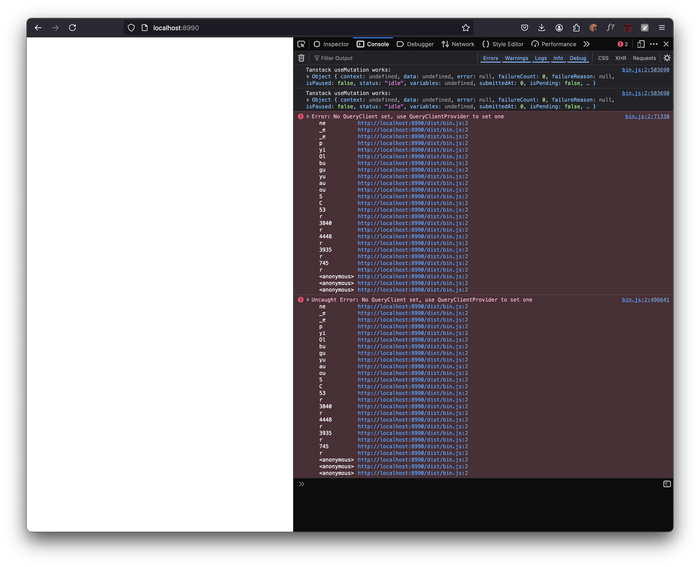

Reproduction for https://github.com/connectrpc/connect-query-es/issues/305

## Running
- `npm install`
- `npm run build` - should output bundled version of `bin_prebundle.js` to `dist/bin.js` 
- `npm run serve`
- open http://localhost:8990/index.html

## Results
Browser console logs should demonstrate that using `useMutation` exported from tanstack directly works, but using the wrapper from connect-query doesn't work. 

> Error: No QueryClient set, use QueryClientProvider to set one

